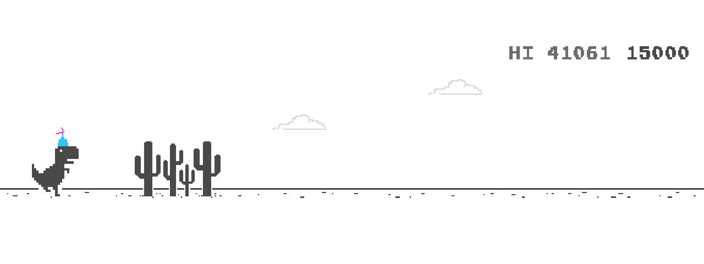

# shuyan

欢迎来到 **shuyan**。

**shuyan**（chancezyw's blog）是较为全面的前端技术栈整理。

**shuyan** 涉及较多领域。我试图整理一个系统的入口，判断自己缺失的技术栈，并且专注核心，主要在于理解核心而不是成为 api 调用师。

目前，**shuyan** 主要包含 **JavaScript** 的基础知识，并正在着力完善以下内容

- JavaScript 中的函数式编程
- 算法相关 

关于上述部分待完善内容，请参见 shuyan 的 [Projects](https://github.com/chancezyw/shuyan/projects)，详细列出了正在做的事项以及待做事项。

当然，**shuyan** 不会局限于 **JavaScript**，在未来，**shuyan** 将会

- 深入 TypeScript
- 深入 Css

此外，鉴于以下两点

- 我不仅仅想写 blog，我试图梳理我的经历和看到的风景，可能会经常回顾，也会一往无前。
- 技术总是保持不断更新，旧的技术在面对新的技术时随时可能失效。

因此，**shuyan** 永远保持更新。

## How to build？

blog 目前采用 [mkdocs](https://github.com/mkdocs/mkdocs) 部署在 [https://chancezyw.github.io/shuyan/](https://chancezyw.github.io/shuyan/)。

> `mkdocs gh-deploy`可以将其直接提交到 gh-pages 分支

## How to practice？

首先，可以通过浏览网上资料来学习一些基本的语法。

其次，可以通过刷题巩固自己的学识。

## What can you read?

- 我的旅行见闻

一些建议：

- 阅读 [提问的智慧](http://www.jianshu.com/p/60dd8e9cd12f)
- 善用 Google 搜索可以帮助你更好地提升自己
- 掌握至少一门编程语言，比如 JavaScript
- 实践比什么都要管用
- 保持对技术的好奇与渴望并坚持下去

## Material color palette 更换颜色主题

### Primary colors 主色

> 默认 `white`

点击色块可更换主题的主色

<button data-md-color-primary="red">Red</button>
<button data-md-color-primary="pink">Pink</button>
<button data-md-color-primary="purple">Purple</button>
<button data-md-color-primary="deep-purple">Deep Purple</button>
<button data-md-color-primary="indigo">Indigo</button>
<button data-md-color-primary="blue">Blue</button>
<button data-md-color-primary="light-blue">Light Blue</button>
<button data-md-color-primary="cyan">Cyan</button>
<button data-md-color-primary="teal">Teal</button>
<button data-md-color-primary="green">Green</button>
<button data-md-color-primary="light-green">Light Green</button>
<button data-md-color-primary="lime">Lime</button>
<button data-md-color-primary="yellow">Yellow</button>
<button data-md-color-primary="amber">Amber</button>
<button data-md-color-primary="orange">Orange</button>
<button data-md-color-primary="deep-orange">Deep Orange</button>
<button data-md-color-primary="brown">Brown</button>
<button data-md-color-primary="grey">Grey</button>
<button data-md-color-primary="blue-grey">Blue Grey</button>
<button data-md-color-primary="white">White</button>

### Accent colors 辅助色

> 默认 `red`

点击色块更换主题的辅助色

<button data-md-color-accent="red">Red</button>
<button data-md-color-accent="pink">Pink</button>
<button data-md-color-accent="purple">Purple</button>
<button data-md-color-accent="deep-purple">Deep Purple</button>
<button data-md-color-accent="indigo">Indigo</button>
<button data-md-color-accent="blue">Blue</button>
<button data-md-color-accent="light-blue">Light Blue</button>
<button data-md-color-accent="cyan">Cyan</button>
<button data-md-color-accent="teal">Teal</button>
<button data-md-color-accent="green">Green</button>
<button data-md-color-accent="light-green">Light Green</button>
<button data-md-color-accent="lime">Lime</button>
<button data-md-color-accent="yellow">Yellow</button>
<button data-md-color-accent="amber">Amber</button>
<button data-md-color-accent="orange">Orange</button>
<button data-md-color-accent="deep-orange">Deep Orange</button>

