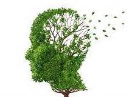

# 如何学习

如何养成良好的学习习惯和思考习惯？

## 大脑结构

在放松的时候，大脑神经网络会生成新的 **突触** 并且「删除」某些老旧的突触

因此可以通过睡前复习一遍的方式让新的突触记住某些重要信息，长此以往能够控制记忆向特定的方向发展

### 良好睡眠

良好的睡眠能加强脑细胞的新陈代谢，有利于新突触的生长

睡眠有助于大脑海马体产生新的神经元，也就是说，你变聪明了。

### _僵尸意识_

- cue 在你做事之前的信号
- routine 惯性，在接到信号之后你的行为
- reward 做出这样行为之后的结果
- belief 养成信念

### _组块_

组块是在集中的思维模式下的重要学习方式。将一些信息关联起来，打包成「压缩包」

以后要回忆这个组块中的所有东西，都不需要整个执行。

e.g 比如你穿衣服，你就能知道如何穿，穿什么一样

#### 怎样形成组块

核心办法

- 分解
- 聚合
- 专注

> 将大的问题分解成小的问题，将小的问题反复练习从而掌握，再将小的解决方案聚合成大的解决方案，那么你最终就解决了这个问题

同时你要知道人的智商有限，世界上没有天才，我们只是普通人，这意味着接受东西的速度有限。因此保持专注才能让你的学习速度最大化，也就是知识 **性价比**

## 番茄工作法

集中精力 25 分钟，然后给予自己奖励，这是克服拖延症的最好办法

### 间隔重复法则

反复能够加强神经网络突触的记忆，即使是很抽象的东西重复十遍也能掌握

反复的技巧在于和番茄工作法结合起来，在一段时间内高强度的学习，然后放松一段时间，让大脑神经网络固化这些新生成突触，并忘记一些不重要的突触

#### 在重复中回顾

单一的重复难免让人乏味，你可以试着闭上眼回顾。

### 克服拖延症

- 隔离危险的信号
- 养成微习惯
- 奖励

#### 如何制定任务

- 只制定明天的任务
- 任务小而精确
- 今天做不完的任务不是明天做而是周末做
- 每天刚开始的时候先做最复杂难做的任务

### 合理运动和学习

- 人的大脑每天都在产生神经元，如果不用掉就会死亡，而老的神经元开始衰弱，所以每天不管学多少，至少学一点

## 思维

### 多用类比和比喻

类比和比喻有利于大脑形成组块

### 以终为始的思维

举个栗子，我们对物流的看法只是更快而已。然而在马云眼中他认为物流的目的是消灭企业的库存。

### 批判思维

根据已有的数据去分析去推断

### 即时反馈

学得到的东西用大白话讲给别人听，你会明白更多

## 五分钟起步法

遇见不想做但是做了会更好的事情，先做五分钟，再谈其他