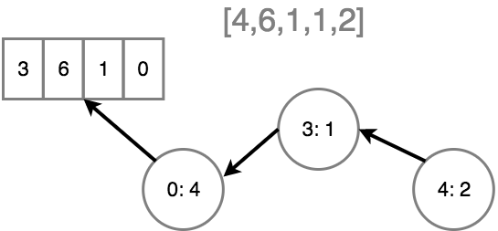

这一节和上节一样，都是为了减少副作用而努力。

如果说编程角度的幂等让一个数值改变的操作变为一次，那么不可变数据结构就是将其变为 0 次。

## 原始数据类型的 immutable

JavaScript 中的原始类型一直是不可变的，无法修改。

但是 JS 有一种奇怪的「装箱」行为，在访问原始类型的属性时触发。

JS 在这种情况下自动将值包裹在一个「装箱对象」中。

```js
let x = 2;
x.length = 4; // 严格模式下报错

x; // 2
x.length; // undefined

let x = new Number(2);

// works fine
x.length = 4;
```

那么，字符串呢？

```js
"use strict";

let s = new String( "hello" );

s[1];               // e
s[1] = "E";         // error
s.length = 10;      // error

s[42] = "?";        // OK

s;                  // "hello"

// 即使是装箱对象，大部分属性也不可以变
let s = new String( "hello" );

s[1] = "E";         // error
s.length = 10;      // error

s[42] = "?";        // OK

s;                  // "hello"
```

## Value to Value

首先，必须在心里上有一个清晰地认知，immutable 数据不代表在整个程序中我们不修改这个值。

immutable 的核心理念是在我们需要修改某个值的时候，我们创建一个新的值而不是对已有的值「突变」。

举个栗子

```js
let addValue = arr => [...arr, 4];

addValue([1,2,3]);    // [1,2,3,4]
```

这意味着我们可以控制我们程序的状态，除了 addValue，没有任何东西能改变状态。

我们也可以复制对象而不是产生对象的「突变」

```js
let user = {
    // ..
};

function updateLastLogin(user) {
    let newUserRecord = Object.assign({}, user);
    newUserRecord.lastLogin = Date.now();
    return newUserRecord;
}

user = updateLastLogin(user);
```

## 非原始数据类型

非原始数据类型作为参数传递时会复制一个引用传递，而不是它本身的值。

```js
let arr = [1,2,3];

foo(arr);

console.log(arr[0]);
```

显然，我们不能保证打印的值仍然为 1，这时我们要用到上一节的技巧

```js
let arr = [1,2,3];

foo([...arr]);         // ha! a copy!

console.log(arr[0]);      // 1
```

## Reassignment

如何定义常量？可能有各种各样不同的回答，但是最接近真相的一个回答就是。

> 一个不能被再分配的变量

这种挑剔的描述很重要。因为这说明了一个常数与他的值无关，不管常数保持什么值，都不能再为这个常数分配其他的值。

```js
let x = 1; // 我们为 x 分配了一个不可以改变的原始值

x = 3; // x: 3

const x = 4; // 我们定义了一个不可以再分配的变量 x

x = 3; // Error

const x = [2];

x[0] = 4; // x: [4]

x = [] // Error
```

我想上面的例子清晰地阐述了「常数」和「常量」的区别。

那么对于 FPer 来说，const 有什么作用呢

### Intent

const 可以明显的从语义上提示读者这个变量是不可以再分配的。

但是 const 的缺点也很明显，首先，对于引用类型，依旧无法保证「突变」，其次，这和 immutable 数据发生冲突。

```js
const magicNums = [1, 2, 3, 4];

magicNums = magicNums.concat(42); // error
```

所以对于 FPer，我们只使用 const 声明一些简单的常量。

如 `const PI = 3.141592653`

需要注意的是，我们关心的重点始终是值的「突变」，而不是变量的分配。

### Freezing

有一种简单的方式让对象、数组、函数变成一个 "immutable value"

```js
let x = Object.freeze([2]);
```

freeze 遍历对象与数组的所有属性和索引，将它们变为已读和「不可被重新配置」，所以这些属性不能被「再分配」。

同时，freeze 将对象标记成不可拓展，也就是无法添加新属性。

但是要注意的是，freeze 不可变的层级只有一层。也就是「shadow immutable」。

如果想要深度 immutable，那么需要递归遍历对象。

```js
let x = Object.freeze([2, 3, [4, 5]]);

// not allowed:
x[0] = 42;

// oops, still allowed:
x[2][0] = 42;
```

与 const 不同的是，const 让你误以为这个值不可变，而 freeze 才真正做到了这点。

```js
let arr = Object.freeze([1,2,3]);

foo(arr);

console.log( arr[0] );          // 1
```

## 性能

当我们每次都新创建一个值而不是「突变」一个存在的值，下一个要关注的点就是性能问题。

是否可以考虑一种特殊的数组结构，存储每一次「增量修改」。

仅记录与上一个版本的差异，而不是整个原始数据结构的重复。



```js
let state = specialArray(4, 6, 1, 1);

let newState = state.set(4, 2); // 在位置 4 上插入 2

state === newState;                 // false

state.get( 2 );                     // 1
state.get( 4 );                     // undefined

newState.get( 2 );                  // 1
newState.get( 4 );                  // 2

newState.slice( 2, 5 );             // [1,1,2]
```

specialArray 用 diff 的方式跟踪每个「突变」，且 state 和 newState 指向数值的不同版本。

[immutable.js](https://immutable-js.github.io/immutable-js/) 提供了一个实现

```js
let state = Immutable.List.of(4, 6, 1, 1);

let newState = state.set(4, 2);

state === newState;                 // false

state.get(2);                     // 1
state.get(4);                     // undefined

newState.get(2);                  // 1
newState.get(4);                  // 2

newState.toArray().slice(2, 5);   // [1,1,2]
```

immutable.js 采用了复杂的性能优化实现。自己实现太麻烦了~

## Treatment

**不管函数接收到一个值是可变的还是不可变的，我们都把它当做 immutable 对待。**

## 总结

immutable 并不意味着一个变量是不变的。immutable 在状态变更时创建和跟踪一个新的值，而不是对现有的值「突变」。

const 其实与 immutable 无关，而 Object.freeze() 提供了一个很好地方法来保证 immutable。

如果遇见性能瓶颈，可以使用第三方库的不可变数据结构。